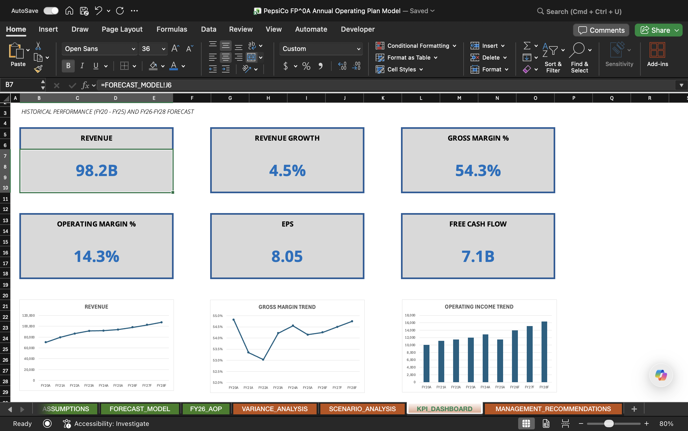
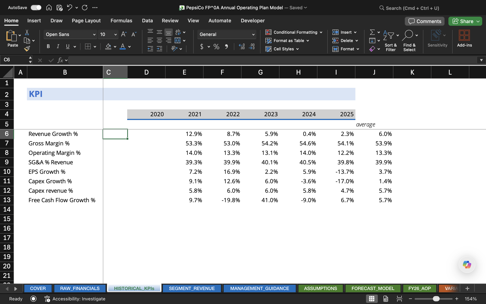
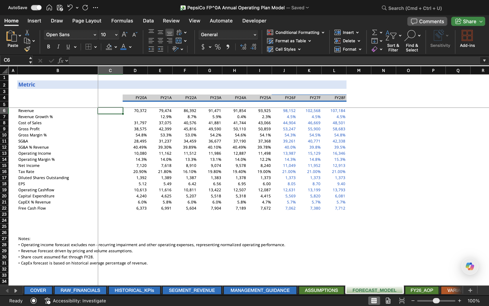
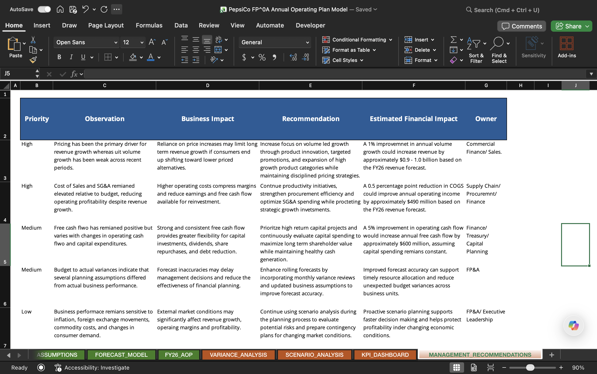

# PepsiCo FP&A Annual Operating Plan (AOP)

### Three-Year Budgeting & Forecasting Model | Microsoft Excel



---

## Project Summary

| Category | Details |
|----------|----------|
| **Company** | PepsiCo |
| **Industry** | Consumer Staples |
| **Project Type** | Financial Planning & Analysis (FP&A) |
| **Tool** | Microsoft Excel |
| **Historical Period** | FY2020–FY2025 |
| **Forecast Period** | FY2026–FY2028 |
| **Forecast Horizon** | 3 Years |
| **Model** | Annual Operating Plan (AOP) |

---

# Project Overview

This project recreates a corporate Financial Planning & Analysis (FP&A) Annual Operating Plan (AOP) process using publicly available PepsiCo financial data. The workbook combines historical financial analysis, driver-based forecasting, budgeting, variance analysis, scenario planning, and executive reporting into a single integrated financial model.

Historical financial performance from FY2020 through FY2025 was analyzed to develop assumptions for forecasting revenue, profitability, earnings, and free cash flow over the FY2026–FY2028 planning horizon. The completed model culminates in an executive dashboard and strategic recommendations similar to those presented during an annual budgeting cycle.

---

# Business Objective

The objective of this project was to simulate the financial planning process performed by an FP&A team by:

- Forecasting revenue, operating income, EPS, and free cash flow
- Building a driver-based financial model using historical performance
- Developing a FY26 Annual Operating Plan (AOP)
- Comparing budget versus actual performance
- Evaluating downside, base, and upside scenarios
- Presenting executive-level insights and strategic recommendations

---

# Key Features

- Historical Financial Statement Analysis
- KPI Trend Analysis
- Revenue Segment Analysis
- Management Guidance Review
- Driver-Based Forecast Model
- FY26 Annual Operating Plan (AOP)
- Budget vs Actual Variance Analysis
- Scenario Analysis (Downside / Base / Upside)
- Executive KPI Dashboard
- Strategic Management Recommendations

---

# Workbook Structure

| Worksheet | Purpose |
|------------|----------|
| **COVER** | Project overview and documentation |
| **RAW_FINANCIALS** | Historical financial statements and supporting data |
| **HISTORICAL_KPIs** | Historical KPI calculations and trend analysis |
| **SEGMENT_REVENUE** | Revenue analysis by operating segment |
| **MANAGEMENT_GUIDANCE** | Key management commentary and qualitative insights |
| **ASSUMPTIONS** | Forecast drivers and planning assumptions |
| **FORECAST_MODEL** | Integrated three-year financial forecast |
| **FY26_AOP** | FY26 Annual Operating Plan and budget summary |
| **VARIANCE_ANALYSIS** | Budget vs Actual performance analysis |
| **SCENARIO_ANALYSIS** | Base, Upside, and Downside forecast scenarios |
| **EXECUTIVE_DASHBOARD** | Executive KPI dashboard and financial visualization |
| **MANAGEMENT_RECOMMENDATIONS** | Strategic recommendations and business actions |

---

# Dashboard Preview

## Executive Dashboard


---

## Historical Performance



---

## Forecast Model



---

## Management Recommendations



---

# Forecast Methodology

The forecasting model was developed using a driver-based planning approach. Historical operating performance, management commentary, and publicly available financial disclosures were analyzed to establish forward-looking assumptions.

Key forecasting drivers include:

- Revenue Growth
- Pricing Growth
- Volume Growth
- Cost Inflation
- Gross Margin
- SG&A as a Percentage of Revenue
- Operating Margin
- Effective Tax Rate
- Capital Expenditure
- Free Cash Flow

The model automatically projects the income statement and key operating metrics through FY2028 based on changes to these assumptions.

---

# Executive Deliverables

The completed model produces management-ready outputs including:

- Historical Performance Dashboard
- Executive KPI Dashboard
- FY26 Budget Summary
- Budget vs Actual Variance Analysis
- Scenario Planning
- Strategic Recommendations

These deliverables mirror the reporting package commonly used during corporate budgeting and planning cycles.

---

# Skills Demonstrated

### Financial Planning & Analysis

- Annual Operating Planning (AOP)
- Budgeting
- Forecasting
- Financial Modeling
- Driver-Based Planning
- Scenario Analysis
- Variance Analysis

### Financial Analysis

- Revenue Forecasting
- Margin Analysis
- Operating Performance Analysis
- KPI Development
- Free Cash Flow Analysis
- Business Performance Reporting

### Microsoft Excel

- Advanced Financial Modeling
- Dynamic Formulas
- Integrated Forecast Models
- Executive Dashboards
- Financial Visualization
- Management Reporting

---

# Data Sources

- PepsiCo SEC 10-K Filings
- PepsiCo Annual Reports
- Investor Relations Publications
- Management Discussion & Analysis (MD&A)

---

# Repository Contents

```
PepsiCo-FP-A-Annual-Operating-Plan
│
├── Excel_Model
│   └── PepsiCo_FP&A_Annual_Operating_Plan_Model.xlsx
│
├── Presentation
│   └── PepsiCo_FP&A_Executive_Presentation.pdf
│
├── Images
│   ├── Executive_Dashboard.png
│   ├── Historical_Performance.png
│   ├── Forecast_Model.png
│   └── Management_Recommendations.png
│
├── README.md
└── LICENSE
```

---

# Author

**Nikhil Venkatareddy**


---

# Disclaimer

This project was independently developed for educational and professional portfolio purposes using publicly available financial information. It is not affiliated with, endorsed by, or sponsored by PepsiCo.
